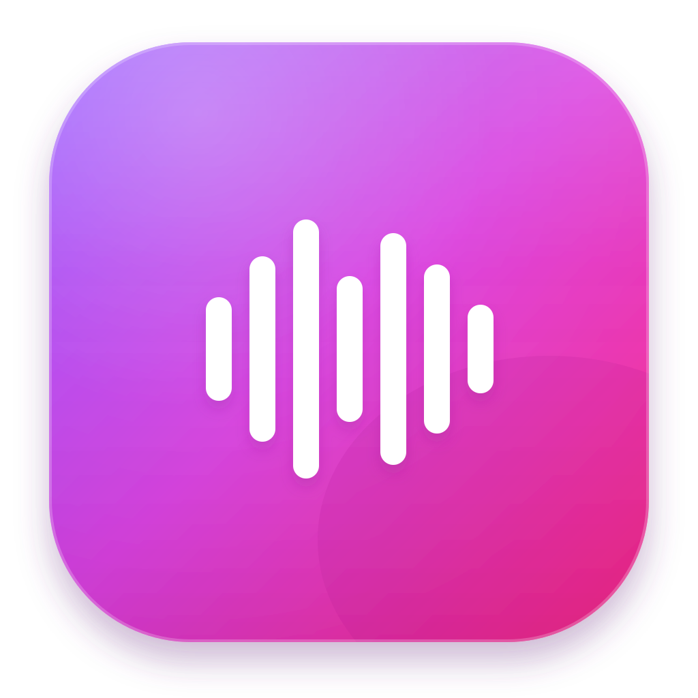
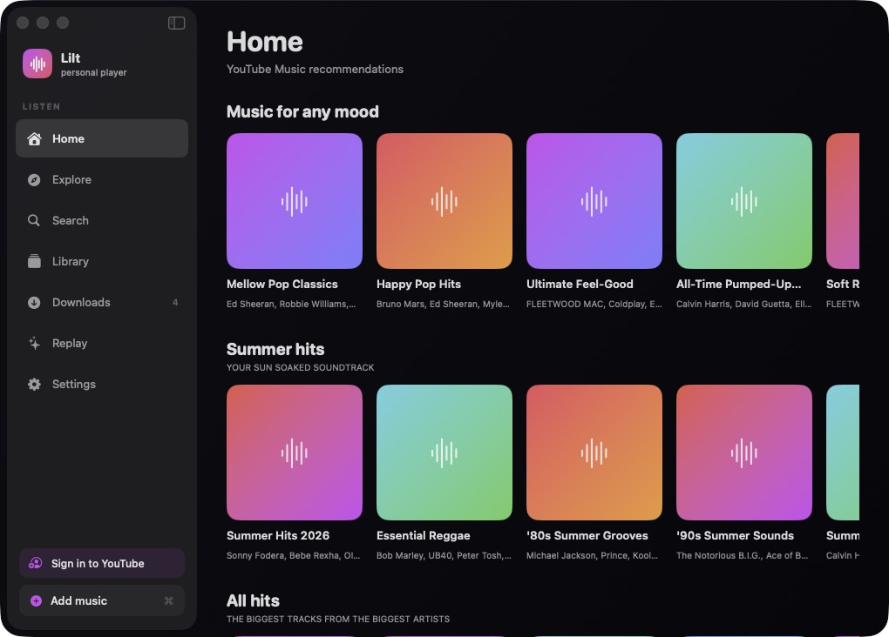

<div align="center">



# Lilt

### A native YouTube Music player for macOS

<a href="https://github.com/aplinxy9plin/lilt/releases/latest"></a>
<a href="LICENSE"></a>

[**Features**](#features) · [**Build**](#build) · [**Support**](#support) · [**Disclaimer**](#disclaimer) · [**License**](#license)

</div>

> [!WARNING]
> Lilt is an independent, unofficial third-party client. It is not affiliated with, endorsed by, sponsored by, or connected to Google LLC, YouTube, or YouTube Music in any way. Use it at your own discretion.

<div align="center">



</div>

## Features

| Category | Features |
| --- | --- |
| **Playback & library** | YouTube Music sign-in with personalized Home, Explore, Search and Library.<br>Persistent queue, media keys and macOS Now Playing integration.<br>Gapless handoff, crossfade, shuffle, repeat and optional AutoPlay radio.<br>Offline downloads, cached audio, local files and indexed folders.<br>Per-network quality profiles and optional alternative audio sources. |
| **Audio & controls** | Ten-band equalizer, preamp and Spatial Audio processing.<br>Optional Automix with beat analysis and tempo-matched transitions.<br>Playback speed, skip silence, sleep timer and full-width volume control.<br>Stats for Nerds with codec, bitrate and sample-rate details. |
| **Experience** | Native SwiftUI interface with system, light and dark appearances.<br>Artwork-driven player colors and animated Canvas artwork.<br>Full-screen Now Playing with line- and word-synced lyrics.<br>Private on-device Replay statistics, charts and stories.<br>Automatic GitHub Releases update checks plus a manual app-menu action.<br>Universal Apple Silicon and Intel builds. |
| **Accounts & privacy** | Optional Last.fm and ListenBrainz scrobbling.<br>Credentials and sessions stored in macOS Keychain.<br>Listening statistics kept locally on the Mac.<br>Portable JSON backup for settings, Replay and search history.<br>No Discord integration or Rich Presence. |

See [the macOS documentation](macOS/README.md) for the complete feature list.

## Build

Requirements:

- macOS 13 or newer
- Xcode 16 or newer

Open [`macOS/BitChordMac.xcodeproj`](macOS/BitChordMac.xcodeproj) and run the
**Lilt** scheme, or build from Terminal:

```sh
xcodebuild \
  -project macOS/BitChordMac.xcodeproj \
  -scheme Lilt \
  -configuration Debug \
  -derivedDataPath macOS/DerivedData \
  build
```

To create a universal personal archive for another Mac:

```sh
macOS/package-personal-release.sh
```

The archive is written to `macOS/Distribution/Lilt-personal-universal.zip`.
The packaging script bundles the playback helpers, signs all nested code with
a Developer ID certificate, submits the app to Apple notarization and verifies
the finished build with Gatekeeper. Run it with the `organizer` argument to
complete notarization through Xcode Organizer instead.

## Tests

```sh
xcodebuild \
  -project macOS/BitChordMac.xcodeproj \
  -scheme Lilt \
  -configuration Debug \
  -derivedDataPath macOS/DerivedData \
  test
```

## Support

If you enjoy Lilt, you can [support its development on DonationAlerts](https://www.donationalerts.com/r/aplin).

## Disclaimer

Lilt is an independent client intended for personal and educational use. It
does not host, upload or distribute music. Media is played from local files or
retrieved from third-party services requested by the user. Availability may
change when those services update their APIs, authentication or playback
requirements. Users are responsible for complying with applicable laws and
the terms of the services they access.

YouTube, YouTube Music and Google are trademarks of Google LLC. Their names
are used only to describe interoperability; no affiliation or endorsement is
implied.

## Repository layout

- `macOS/` — native SwiftUI application, packaging scripts and tests.
- `native/analyzer/` — C++ audio analysis and resampling used by Automix.

Lilt began as a macOS port of
[BitChord by Kushagra Singh](https://github.com/kushagrasinghx/BitChord).

## License

Licensed under the [GNU General Public License v3.0](LICENSE).
